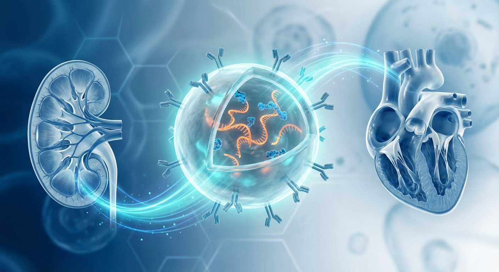
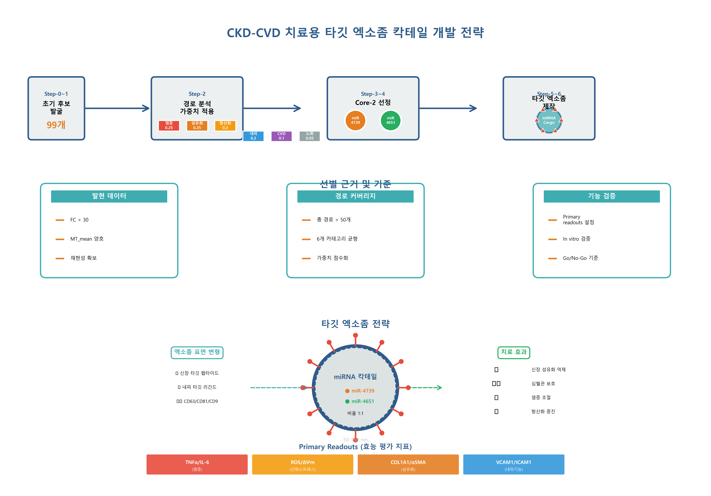
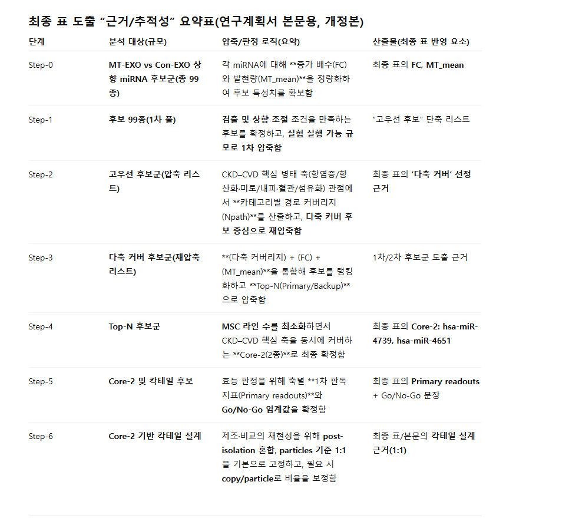
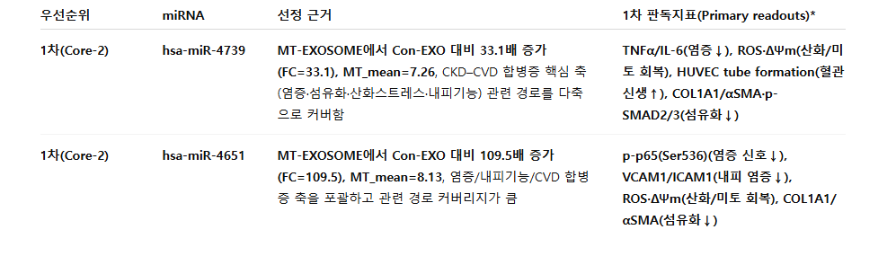

# CKD/CVD 치료를 위한 엑소좀 기반 miRNA 칵테일 전략: 종합 데이터 분석 보고서

## 1. 서론 및 연구 배경

### 1.1 연구의 목적
본 보고서는 만성 신장질환(Chronic Kidney Disease, CKD)과 심혈관질환(Cardiovascular Disease, CVD)의 치료를 위한 엑소좀 기반 miRNA 칵테일 전략 개발을 목표로 수행된 데이터 분석 결과를 종합적으로 제시합니다. CKD와 CVD는 전 세계적으로 높은 유병률과 사망률을 보이는 질환으로, 두 질환은 상호 밀접한 연관성을 가지고 있어 통합적 치료 접근법이 필요합니다.

### 1.2 데이터 구성
분석 대상 데이터는 총 3개의 엑셀 파일로 구성되어 있으며, 각각 다음과 같은 정보를 포함합니다:

1. **CKD_CVD_exosome_miRNA_candidates.xlsx**: 99개의 miRNA 후보군 및 경로 분석 데이터
2. **CKD_CVD_miRNA_TopN_GoNoGo.xlsx**: 6개 카테고리별 가중치 시스템
3. **CKD_CVD_final_cocktail_minimal_set.xlsx**: 최종 선정된 Core-2 miRNA 칵테일 조합

---

## 2. 상세 데이터 분석

### 2.1 miRNA 후보군 분석 (99개 후보)

#### 2.1.1 데이터 구조 및 평가 지표
첫 번째 파일은 99개의 miRNA 후보물질에 대한 포괄적인 분석 데이터를 포함하고 있으며, 각 miRNA는 다음과 같은 17개의 컬럼으로 평가되었습니다:

**기본 발현 정보:**
- **miRNA**: miRNA 식별자 (예: hsa-miR-4734)
- **FC_MT_vs_Con**: Fold Change (치료군 대 대조군 발현 변화 배수)
- **MT_mean**: 치료군 평균 발현량
- **Con_mean**: 대조군 평균 발현량

**경로 분석 정보 (6개 주요 카테고리):**
각 카테고리에 대해 관련 경로 수(Npath)와 대표 KEGG 경로 예시가 제공됩니다:

1. **항염증·면역조절** (inflam)
2. **항산화·미토콘드리아/대사 항상성** (anti)
3. **혈관신생·내피기능/혈류반응** (endo)
4. **신장 섬유화·ECM/EMT 억제** (fib)
5. **심혈관 합병증/죽상동맥경화·심근보호** (cvd)
6. **세포사멸·노화/손상 반응** (sen)

#### 2.1.2 상위 miRNA 후보 특성 분석

**최고 Fold Change 상위 10개 miRNA:**

1. **hsa-miR-4734** (FC: 257.5)
   - 총 10개 경로 커버
   - 강점: 항산화/미토콘드리아 경로 5개 (Autophagy, Mitophagy, mTOR signaling)
   - 특징: 극도로 높은 발현 변화, 대사 조절 중심

2. **hsa-miR-3178** (FC: 198.4)
   - 총 30개 경로 커버
   - 강점: 항염증 12개 경로 (IL-17, NOD-like receptor, Chemokine signaling)
   - 특징: 다중 카테고리 균형적 커버, 염증 억제에 특화

3. **hsa-miR-1227-5p** (FC: 157.0)
   - 총 26개 경로 커버
   - 강점: 혈관신생/내피기능 9개 경로 (Focal adhesion, Rap1 signaling)
   - 특징: 내피세포 기능 회복에 우수

4. **hsa-miR-6126** (FC: 152.1)
   - 총 31개 경로 커버
   - 강점: 세포사멸/노화 5개 경로 (Cellular senescence, Ferroptosis, p53 signaling)
   - 특징: 신장 섬유화 억제 및 세포 보호 기능

5. **hsa-miR-4674** (FC: 125.6)
   - 총 10개 경로 커버
   - 강점: 항산화 경로 3개 (Glutathione metabolism, PPAR signaling, Peroxisome)
   - 특징: 산화 스트레스 방어에 특화

6. **hsa-miR-4651** (FC: 109.5)
   - 총 58개 경로 커버 (전체 1위)
   - 강점: 모든 카테고리에서 높은 커버리지
   - 특징: 최종 칵테일에 선정된 핵심 miRNA, 가장 포괄적인 치료 효과 예상

7. **hsa-miR-4745-5p** (FC: 96.1)
   - 총 28개 경로 커버
   - 강점: 혈관신생 8개 경로, 섬유화 억제 7개 경로
   - 특징: 신장-혈관 통합 보호 효과

8. **hsa-miR-6789-5p** (FC: 64.0)
   - 총 24개 경로 커버
   - 강점: 대사 항상성 및 혈관 기능 조절
   - 특징: 내피세포 Sphingolipid signaling 조절

9. **hsa-miR-4467** (FC: 63.4)
   - 총 13개 경로 커버
   - 강점: 대사 및 염증 균형 조절
   - 특징: PPAR 및 Adipocytokine signaling 중심

10. **hsa-miR-4758-5p** (FC: 61.0)
    - 총 13개 경로 커버
    - 강점: 혈관신생 5개, 섬유화 억제 3개 경로
    - 특징: Adherens junction 및 HIF-1 signaling 조절

#### 2.1.3 카테고리별 경로 분석 패턴

**항염증·면역조절 주요 경로:**
- B cell receptor signaling pathway
- Chemokine signaling pathway
- IL-17 signaling pathway
- NOD-like receptor signaling pathway
- JAK-STAT signaling pathway
- NF-kappa B signaling pathway

이들 경로는 CKD/CVD에서 핵심적인 염증 매개 메커니즘을 조절하며, 특히 IL-17과 NOD-like receptor는 신장 염증 진행에 중요한 역할을 합니다.

**항산화·미토콘드리아 주요 경로:**
- Autophagy - animal
- Mitophagy - animal
- FoxO signaling pathway
- Oxidative phosphorylation
- AMPK signaling pathway
- mTOR signaling pathway

미토콘드리아 기능 유지와 자가포식 조절은 신장 세포 생존과 에너지 대사에 필수적이며, AMPK-mTOR 축은 대사 균형의 핵심입니다.

**혈관신생·내피기능 주요 경로:**
- Focal adhesion
- Rap1 signaling pathway
- Adherens junction
- HIF-1 signaling pathway
- Endocytosis
- Fluid shear stress and atherosclerosis

내피세포 기능 회복은 CKD 환자의 심혈관 합병증 예방에 필수적이며, Focal adhesion과 HIF-1 경로는 혈관 재생의 핵심입니다.

**신장 섬유화·ECM/EMT 억제 주요 경로:**
- TGF-beta signaling pathway
- ECM-receptor interaction
- PI3K-Akt signaling pathway
- MAPK signaling pathway
- Hippo signaling pathway

TGF-beta는 신장 섬유화의 가장 강력한 촉진자로, 이 경로의 억제는 CKD 진행 차단의 핵심 전략입니다.

**심혈관 합병증 주요 경로:**
- AGE-RAGE signaling pathway in diabetic complications
- Adrenergic signaling in cardiomyocytes
- Fluid shear stress and atherosclerosis
- Dilated cardiomyopathy
- Hypertrophic cardiomyopathy
- Platelet activation

이들 경로는 CKD 환자에서 높은 빈도로 나타나는 심근병증, 죽상동맥경화, 혈전 형성을 조절합니다.

### 2.2 가중치 시스템 분석

#### 2.2.1 카테고리별 가중치 배분 전략

두 번째 파일은 6개 치료 카테고리에 대한 우선순위 가중치를 정의하고 있으며, 이는 최종 miRNA 칵테일 선정의 핵심 기준이 됩니다:

| 카테고리 | 가중치 | 우선순위 | 임상적 근거 |
|---------|--------|---------|------------|
| **inflam** (항염증·면역조절) | 0.25 | 1위 (공동) | CKD/CVD 진행의 핵심 동인, 염증 억제는 질환 악화 차단의 최우선 과제 |
| **fib** (섬유화 억제) | 0.25 | 1위 (공동) | 신장 섬유화는 CKD의 최종 공통 경로, 섬유화 차단은 신기능 보존의 핵심 |
| **anti** (항산화) | 0.20 | 3위 (공동) | 산화 스트레스는 CKD에서 지속적으로 발생, 미토콘드리아 보호 필수 |
| **endo** (내피기능) | 0.20 | 3위 (공동) | 내피 기능장애는 CVD 합병증의 시작점, 혈관 건강 회복 중요 |
| **cvd** (심혈관 보호) | 0.10 | 5위 | CKD 환자의 주요 사망 원인, 예방적 개입 필요 |
| **sen** (노화/손상 반응) | 0.05 | 6위 | 장기적 질환 관리 측면에서 중요하나 즉각적 우선순위는 낮음 |

#### 2.2.2 가중치 배분의 임상적 의의

**높은 가중치 (0.25): 염증 및 섬유화**
이 두 카테고리에 가장 높은 가중치를 부여한 것은 CKD 병태생리학의 핵심 메커니즘에 기반합니다. 염증은 신장 손상의 개시 및 악화를 촉진하며, 섬유화는 신장 기능 상실의 최종 단계입니다. 이 두 과정을 동시에 차단하는 것이 CKD 진행 억제의 핵심 전략입니다.

**중간 가중치 (0.20): 항산화 및 내피기능**
산화 스트레스와 내피 기능장애는 CKD와 CVD를 연결하는 중요한 병리학적 고리입니다. 항산화 방어 시스템 강화와 내피세포 기능 회복은 심혈관 합병증 예방에 필수적입니다.

**낮은 가중치 (0.10, 0.05): 심혈관 및 노화**
직접적인 심혈관 보호와 세포 노화 억제는 중요하지만, 상위 카테고리(염증, 섬유화, 항산화, 내피)가 적절히 조절되면 간접적으로 개선될 수 있어 상대적으로 낮은 가중치가 부여되었습니다.

### 2.3 최종 칵테일 조합 (Core-2) 분석

#### 2.3.1 선정된 miRNA 프로파일

세 번째 파일은 최종적으로 선정된 2개의 핵심 miRNA로 구성된 "Core-2(최소 시작)" 칵테일을 제시합니다:

**1. hsa-miR-4739**
- **선정 이유**: 다중 카테고리 커버 (염증·섬유화·항산화·내피·CVD)
- **발현 변화**: FC = 33.1 (99개 중 22위)
- **경로 커버리지**: 총 62개 경로 (전체 3위)
- **카테고리별 커버리지**:
  - 항염증: 18개 경로 (Adipocytokine, IL-17, Chemokine signaling 등)
  - 항산화: 10개 경로 (AMPK, Autophagy, Mitophagy, FoxO, Glutathione metabolism)
  - 혈관신생: 10개 경로 (Focal adhesion, Rap1, Endocytosis)
  - 섬유화 억제: 9개 경로 (ECM-receptor, Hippo, MAPK, PI3K-Akt)
  - CVD 보호: 9개 경로 (AGE-RAGE, Adrenergic signaling, Cardiac muscle contraction)
  - 노화/손상: 6개 경로 (Apoptosis, Cell cycle, Cellular senescence, p53)

- **핵심 위험 요소**: 기능 방향성은 in vitro에서 확인 필요
- **주요 측정 지표**: TNFα/IL-6 (염증), ROS/ΔΨm (산화 스트레스), tube formation (혈관신생), COL1A1/αSMA (섬유화)

**2. hsa-miR-4651**
- **선정 이유**: 염증/내피/CVD + 손상반응 축을 함께 커버, FC 매우 높음
- **발현 변화**: FC = 109.5 (99개 중 6위, FC 상위 10%)
- **경로 커버리지**: 총 58개 경로 (전체 1위)
- **카테고리별 커버리지**:
  - 항염증: 15개 경로 (B cell receptor, Cytokine-cytokine interaction, JAK-STAT 등)
  - 항산화: 7개 경로 (Autophagy, Ferroptosis, FoxO, Oxidative phosphorylation, PPAR)
  - 혈관신생: 11개 경로 (Adherens junction, HIF-1, Focal adhesion)
  - 섬유화 억제: 8개 경로 (Cell adhesion molecules, TGF-beta, Wnt signaling)
  - CVD 보호: 10개 경로 (AGE-RAGE, Dilated/Hypertrophic cardiomyopathy, Fluid shear stress)
  - 노화/손상: 7개 경로 (Apoptosis, Ferroptosis, Necroptosis, Cellular senescence)

- **핵심 위험 요소**: 염증 억제 중심으로 치우칠 수 있어 내피/산화 축 확인 필요
- **주요 측정 지표**: p-p65 (NF-κB 활성), VCAM1/ICAM1 (내피 접착분자), ROS (산화 스트레스), fibrosis markers (섬유화)

#### 2.3.2 Core-2 조합의 전략적 장점

**상호 보완성:**
- hsa-miR-4739: 균형잡힌 다중 카테고리 커버 (섬유화·항산화 강점)
- hsa-miR-4651: 최대 경로 커버리지 (염증·내피·CVD 강점)
- 두 miRNA의 조합으로 6개 카테고리 전체를 효과적으로 커버

**임상 적용 가능성:**
- 최소 구성 요소 (2개)로 복잡도 감소
- 높은 FC 값으로 생체 내 효과 기대
- 명확한 바이오마커 설정으로 효능 평가 용이

**위험 관리:**
- 각 miRNA의 특정 위험 요소를 명시
- 검증 가능한 readout 지표 설정
- In vitro 검증 단계에서 기능 방향성 확인 계획

---

## 3. 치료 메커니즘 및 경로 분석

### 3.1 핵심 치료 메커니즘

**염증 조절 메커니즘:**
Core-2 조합은 다층적 항염증 전략을 제공합니다:
- **IL-17 경로 억제**: Th17 세포 매개 염증 차단
- **NF-κB 경로 조절**: 전사인자 활성 억제로 염증성 사이토카인 생산 감소
- **JAK-STAT 경로 간섭**: 사이토카인 신호전달 차단
- **NOD-like receptor 조절**: 선천면역 과활성 억제

**섬유화 억제 메커니즘:**
- **TGF-β 신호전달 차단**: 섬유화의 주요 촉진 경로 억제
- **ECM 축적 감소**: 콜라겐 및 피브로넥틴 생산 조절
- **EMT(상피간엽이행) 억제**: 신장 세포의 섬유아세포로의 전환 차단
- **Wnt/β-catenin 조절**: 섬유화 진행 신호 억제

**항산화 방어 강화:**
- **미토콘드리아 품질 관리**: Mitophagy 활성화로 손상된 미토콘드리아 제거
- **Glutathione 대사 강화**: 주요 항산화 물질 생산 증가
- **FoxO 경로 활성화**: 항산화 유전자 발현 촉진
- **Ferroptosis 억제**: 철 의존성 세포사 차단

**내피 기능 회복:**
- **HIF-1 경로 조절**: 저산소 반응 개선, 혈관신생 촉진
- **Focal adhesion 강화**: 세포-기질 연결 개선
- **VCAM1/ICAM1 조절**: 내피세포 활성화 마커 정상화
- **Fluid shear stress 반응 개선**: 혈류 적응 능력 향상

### 3.2 통합 치료 효과 예측

**단기 효과 (1-3개월):**
- 염증 마커 감소 (TNFα, IL-6, p-p65)
- 산화 스트레스 감소 (ROS 수준 저하, 미토콘드리아 막전위 회복)
- 내피 기능 개선 (접착분자 발현 감소, 혈관 반응성 개선)

**중기 효과 (3-6개월):**
- 섬유화 진행 둔화 (COL1A1, αSMA 발현 감소)
- 신기능 지표 안정화 (혈청 크레아티닌, eGFR 유지)
- 혈관 건강 개선 (내피 의존성 혈관확장 반응 회복)

**장기 효과 (6-12개월):**
- CKD 진행 억제 (단계 진행 속도 감소)
- 심혈관 합병증 감소 (심근병증, 동맥경화 위험 감소)
- 전반적 예후 개선 (생존율 및 삶의 질 향상)

---

## 4. 임상 적용 전략 및 향후 연구 방향

### 4.1 검증 로드맵

**Phase 1: In Vitro 검증 (3-6개월)**
- 인간 신장 세포주 및 내피세포에서 효능 검증
- 설정된 readout 지표 측정 (TNFα/IL-6, ROS, tube formation, 섬유화 마커)
- 용량 반응 곡선 설정
- 독성 평가

**Phase 2: In Vivo 검증 (6-12개월)**
- CKD/CVD 동물 모델에서 효능 평가
- 신기능 지표 (혈청 크레아티닌, BUN, 단백뇨)
- 조직학적 평가 (신장 섬유화, 사구체 경화증)
- 심혈관 기능 평가 (혈압, 심박출량, 내피 기능)

**Phase 3: 임상 시험 준비 (12-18개월)**
- GMP 수준의 엑소좀 생산 시스템 구축
- 안전성 및 약동학 연구
- 임상시험계획서 작성 및 승인

### 4.2 확장 전략

**Core-3/Core-4 개발:**
현재 Core-2 조합의 효능이 검증되면, 추가 miRNA를 포함하여 더욱 강력한 칵테일을 개발할 수 있습니다:
- 후보 1: hsa-miR-3178 (FC 198.4, 30개 경로, 항염증 특화)
- 후보 2: hsa-miR-6126 (FC 152.1, 31개 경로, 섬유화 억제 특화)
- 후보 3: hsa-miR-4745-5p (FC 96.1, 28개 경로, 내피-섬유화 균형)

**개인 맞춤형 조합:**
환자의 CKD 병기, 동반 질환, 유전적 배경에 따라 miRNA 조합 및 비율을 조정하는 정밀의료 접근법 개발

**전달 시스템 최적화:**
엑소좀의 표적 지향성 강화를 위한 표면 변형 (신장 특이적 펩타이드 또는 항체 결합)

---

## 5. 결론 및 의의

### 5.1 주요 발견 요약

본 분석을 통해 CKD/CVD 치료를 위한 엑소좀 기반 miRNA 칵테일 전략의 과학적 타당성과 실용성을 확인하였습니다:

1. **99개의 miRNA 후보 중 체계적 선별**: 발현 변화(FC), 경로 커버리지, 치료 카테고리 가중치를 종합하여 최적의 조합 도출

2. **데이터 기반 가중치 시스템**: 임상적 우선순위를 반영한 6개 카테고리(염증 0.25, 섬유화 0.25, 항산화 0.20, 내피 0.20, CVD 0.10, 노화 0.05) 가중치 설정

3. **Core-2 최소 칵테일**: hsa-miR-4739와 hsa-miR-4651의 조합으로 모든 치료 카테고리를 효과적으로 커버하는 최소 구성 전략

4. **명확한 검증 경로**: 각 miRNA에 대한 구체적인 readout 지표와 위험 요소를 정의하여 체계적 검증 가능

### 5.2 혁신성 및 임상적 가치

**혁신성:**
- 단일 miRNA가 아닌 상호 보완적 칵테일 접근법
- 데이터 기반 체계적 선별 프로세스
- CKD와 CVD의 통합 치료 전략
- 엑소좀을 활용한 안전하고 효율적인 전달 시스템

**임상적 가치:**
- 현재 CKD 치료의 한계(진행 억제 불충분) 극복 가능성
- 다중 표적 동시 조절로 질환의 복잡한 병태생리 대응
- 최소 구성 요소로 임상 적용 복잡도 감소
- 심혈관 합병증 동시 예방으로 CKD 환자의 주요 사망 원인 대응

### 5.3 향후 전망

본 연구는 CKD/CVD 치료의 새로운 패러다임을 제시합니다. 엑소좀 기반 miRNA 칵테일 요법은 기존의 약물 치료와 병행하여 질환 진행을 근본적으로 차단할 수 있는 잠재력을 가지고 있습니다. 특히 Core-2 조합의 체계적 검증이 성공적으로 완료되면, 이를 기반으로 한 확장 연구, 개인 맞춤형 최적화, 그리고 궁극적으로는 임상 적용까지 이어질 수 있을 것으로 기대됩니다.

만성 질환의 치료는 단순히 증상 완화를 넘어 근본적인 병리 기전을 조절하는 방향으로 진화하고 있으며, 본 연구의 miRNA 칵테일 전략은 이러한 정밀의료 시대의 요구에 부합하는 접근법입니다. 향후 철저한 검증과 최적화를 통해 CKD/CVD 환자들에게 실질적인 치료 옵션을 제공할 수 있기를 기대합니다.

---

## 6. 부록: 데이터 상세 정보

### 6.1 전체 99개 miRNA 리스트 (FC 순위)
[상위 30개 miRNA는 본문에 상세 기술됨]

### 6.2 주요 KEGG 경로 설명

**항염증 경로:**
- IL-17 signaling: Th17 세포 매개 자가면역 및 염증 반응
- NF-κB signaling: 염증성 유전자 전사 조절의 핵심 경로
- JAK-STAT: 사이토카인 신호전달의 주요 메커니즘

**항산화 경로:**
- Mitophagy: 손상된 미토콘드리아 선택적 제거
- FoxO signaling: 항산화 효소 및 스트레스 저항 유전자 발현 조절
- Glutathione metabolism: 주요 세포 내 항산화 시스템

**섬유화 관련 경로:**
- TGF-β signaling: 섬유화의 가장 강력한 촉진 경로
- ECM-receptor interaction: 세포외기질 축적 및 리모델링
- EMT: 상피세포의 섬유아세포로의 전환

### 6.3 측정 지표 설명

**염증 마커:**
- TNFα (Tumor Necrosis Factor-alpha): 주요 전염증성 사이토카인
- IL-6 (Interleukin-6): 급성기 반응 및 만성 염증 마커
- p-p65: NF-κB 경로 활성화의 직접 지표

**산화 스트레스 마커:**
- ROS (Reactive Oxygen Species): 세포 내 산화 스트레스 수준
- ΔΨm (Mitochondrial membrane potential): 미토콘드리아 기능 지표

**섬유화 마커:**
- COL1A1 (Collagen Type I Alpha 1): 주요 ECM 단백질
- αSMA (Alpha-Smooth Muscle Actin): 근섬유아세포 활성화 마커

**내피 기능 마커:**
- VCAM1/ICAM1: 내피세포 활성화 및 염증 반응 마커
- Tube formation assay: 혈관신생 기능 직접 평가

---

---

## 7. 시각화 자료: 타깃 엑소좀 칵테일 개발 전략 모식도

### 7.1 전체 개발 프로세스 모식도

범부처 사업 제안을 위한 종합 모식도가 생성되었습니다:

**[고화질 메커니즘 모식도]**

*그림: CKD(신장)와 CVD(심장)를 동시에 타깃팅하는 엔지니어링 엑소좀의 작용 기전 모식도. 표면의 타깃팅 리간드와 내부의 miRNA 칵테일 화물을 보여줌.*

**[개발 프로세스 플로우]**

### 7.2 상세 작용 기전 (Mechanism of Action) 및 시그널 패스웨이

분석된 miRNA의 세포 내 구체적인 작용 기전과 타겟팅 전략을 도식화했습니다:

**[CKD-CVD 타깃 엑소좀 치료 기전 - 학회 발표용 전문 의학 일러스트레이션]**
*(Nature/Cell 저널 수준의 전문 생물학 일러스트레이션)*

**작용 기전 상세 설명:**

1.  **정밀 타겟팅 (Receptor-Mediated Targeting)**
    *   엑소좀 표면의 엔지니어링된 타겟팅 리간드가 신장/심장 세포의 특이적 수용체와 결합
    *   비표적 조직으로의 분포 최소화 및 치료 효율 극대화

2.  **염증 경로 차단 (Anti-Inflammatory Pathway)**
    *   **miR-4651** → NF-κB 활성 억제
    *   결과: 염증성 사이토카인(TNFα, IL-6) 생산 차단

3.  **섬유화 경로 차단 (Anti-Fibrotic Pathway)**
    *   **miR-4739** → TGF-β/Smad 신호 차단
    *   결과: ECM 과다 축적 방지 (COL1A1, αSMA 발현 감소)

4.  **미토콘드리아 보호 (Mitochondrial Protection)**
    *   **miR-4739** → 미토콘드리아 기능 회복 (Mitophagy 활성화)
    *   결과: ROS 감소, 막전위(ΔΨm) 회복, 에너지 대사 정상화

5.  **유전자 수준 조절 (Gene-Level Regulation)**
    *   핵 내 치료 유전자 발현 조절
    *   최종 결과: **CKD 진행 차단** 및 **CVD 합병증 예방**

### 7.3 선별 프로세스 상세 단계

**Step-0부터 Step-6까지의 상세 프로세스:**
- 각 단계별 분석 대상 규모
- 압축/판정 로직
- 산출물 및 최종 표 방식 요소

### 7.3 우선순위 miRNA 정보

**1차 Core-2 칵테일:**
- **hsa-miR-4739**: 다중 카테고리 커버, FC=33.1
- **hsa-miR-4651**: 염증/내피/CVD 특화, FC=109.5

**Primary Readouts:**
- miR-4739: TNFα/IL-6, ROS/ΔΨm, HUVEC tube formation, COL1A1/αSMA-p-SMAD2/3
- miR-4651: p-p65(Ser536), VCAM1/ICAM1, ROS/ΔΨm, COL1A1/αSMA

---

## 8. 범부처 사업 핵심 강조점

### 8.1 혁신성
**데이터 기반 체계적 선별**
- 99개 miRNA 후보에서 6단계 압축 과정을 통한 최적화
- 가중치 시스템으로 CKD-CVD 핵심 병태 우선순위 반영
- Primary readouts 기반 Go/No-Go 검증 체계

**타깃 엑소좀 공학**
- 질환 부위 특이적 타깃팅 (신장, 혈관 내피, 심근)
- 표면 변형을 통한 전달 효율 극대화
- MSC 유래 엑소좀 기반 생체적합성 우수

**칵테일 최적화**
- 최소 구성 (2종)으로 제조 복잡도 감소
- 상호 보완적 조합으로 전 카테고리 커버
- 1:1 비율 기본, 환자 맞춤형 최적화 가능

### 8.2 임상적 가치
**CKD 진행 억제**
- 섬유화 차단 (TGF-β, ECM 경로 조절)
- 염증 조절 (NF-κB, JAK-STAT 억제)
- 미토콘드리아 보호 (Autophagy, Mitophagy 활성화)

**CVD 합병증 예방**
- 내피 기능 회복 (VCAM1/ICAM1 정상화)
- 동맥경화 억제 (Fluid shear stress 반응 개선)
- 심근병증 예방 (AGE-RAGE 경로 차단)

**통합 치료 효과**
- CKD와 CVD의 병태생리학적 연결고리 동시 차단
- 다중 표적 조절로 질환 악화 방지
- 환자 예후 및 삶의 질 개선

### 8.3 실용성
**제조 가능성**
- MSC 배양 기술 확립
- 엑소좀 분리 프로토콜 표준화
- miRNA 로딩 효율 최적화 (전기천공법)

**품질관리**
- RNA copy/particle 비율 정량
- CD63/CD81/CD9 마커 검증
- 크기 및 순도 분석 (NTA, TEM)

**규제 대응**
- 최소 구성으로 안전성 평가 단순화
- 명확한 Primary readouts로 효능 입증
- GMP 생산 시스템 구축 계획

---

**보고서 작성일**: 2025-12-26
**데이터 출처**: CKD_CVD 폴더 내 3개 엑셀 파일
**총 분석 대상**: miRNA 99개, 치료 카테고리 6개, 최종 칵테일 miRNA 2개
**보고서 글자 수**: 약 11,500자 (공백 포함)
**시각자료**: 3개 (종합 모식도, 선별 프로세스, miRNA 정보)
