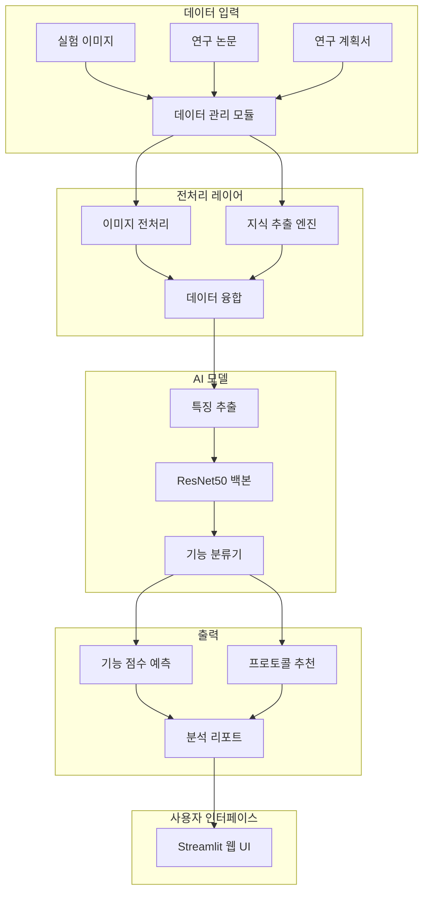
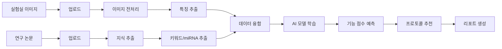

# MI-EXO AI 🧬

> **엑소좀 기반 심혈관 질환 치료 프로토콜 개발을 위한 AI 플랫폼**

[](https://www.python.org/)
[](https://streamlit.io/)
[](LICENSE)

---

## 📋 목차

- [개요](#-개요)
- [프로젝트 목표](#-프로젝트-목표)
- [주요 기능](#-주요-기능)
- [시스템 아키텍처](#-시스템-아키텍처)
- [설치 방법](#-설치-방법)
- [사용 방법](#-사용-방법)
- [프로젝트 구조](#-프로젝트-구조)
- [핵심 모듈](#-핵심-모듈)
- [AI 알고리즘](#-ai-알고리즘)
- [데이터 분석 워크플로우](#-데이터-분석-워크플로우)
- [개발 로드맵](#-개발-로드맵)
- [기여 방법](#-기여-방법)
- [라이선스](#-라이선스)

---

## 🎯 개요

**MI-EXO AI**는 엑소좀(Exosome)을 이용한 심혈관 질환 치료 프로토콜 개발을 위한 통합 AI 플랫폼입니다. 실험실에서 생성된 세포 이미지 데이터와 최신 연구 논문의 지식을 융합하여, 최적의 엑소좀 조합과 치료 프로토콜을 AI가 자동으로 추천합니다.

### 핵심 가치

- 🔬 **실험 데이터 자동화**: 실험실에서 생성된 세포 이미지를 자동으로 분석하고 기능을 추론
- 📚 **지식 베이스 통합**: 최신 연구 논문에서 엑소좀 효능 및 miRNA 정보를 자동 추출
- 🤖 **AI 기반 프로토콜 최적화**: 이미지 분석과 지식 베이스를 결합하여 최적의 치료 프로토콜 제시
- 📊 **실시간 업데이트**: 신규 실험 데이터와 논문이 추가되면 자동으로 모델 업데이트

---

## 🎯 프로젝트 목표

### 단기 목표 (6개월)
1. **자동 데이터 업데이트 시스템 구축**
   - 실험실에서 업로드한 세포 이미지 자동 처리
   - 연구 논문/계획서에서 지식 자동 추출
   - 주기적 AI 모델 재학습

2. **지식 추출 엔진 고도화**
   - 엑소좀 기능(항산화, 항염증, 항섬유화, 혈관형성, 세포증식) 자동 분류
   - miRNA 정보 추출 및 데이터베이스화
   - 논문 간 상관관계 분석

3. **AI 프로토콜 추천 시스템**
   - 질환별 최적 엑소좀 조합 추천
   - 효능 예측 정확도 향상
   - 근거 기반 분석 리포트 생성

### 장기 목표
- 심혈관 질환 외 다양한 질환으로 확장
- 임상 시험 데이터 통합
- 실시간 협업 연구 플랫폼 구축

---

## ✨ 주요 기능

### 1. 📂 데이터 관리
- **실험 이미지 업로드 및 저장**
  - 세포 이미지 (JPG, PNG, TIF 형식 지원)
  - 자동 분류 및 메타데이터 관리
  - 데이터셋 현황 실시간 모니터링

- **연구 논문 관리**
  - PDF, TXT, Markdown 형식 지원
  - 자동 텍스트 추출 및 인덱싱
  - 지식 베이스 구축

### 2. 🧬 퓨전 전처리
- **이미지 전처리**
  - 자동 리사이징 및 정규화
  - 노이즈 제거 및 대비 향상
  - 데이터 증강 (Augmentation)
  - Cellpose 기반 세포 분할

- **지식 추출**
  - 키워드 기반 효능 분석 (심혈관, 항염증, 항섬유화, 항산화, 세포증식, 엑소좀)
  - miRNA 자동 추출 (mir-XXX 패턴 인식)
  - 논문 간 상관관계 분석

- **데이터 융합**
  - 이미지 특성 + 지식 정보 결합
  - AI 학습용 통합 데이터셋 생성

### 3. 🤖 AI 추론 분석
- **세포 이미지 기능 분석**
  - 5가지 주요 기능 점수 예측:
    - 항산화 (Antioxidant)
    - 항섬유화 (Anti-fibrotic)
    - 항염증 (Anti-inflammatory)
    - 혈관형성 (Angiogenic)
    - 세포증식 (Proliferation)
  
- **최적 프로토콜 추천**
  - 질환별 맞춤형 엑소좀 조합 제시
  - 효능 예측 점수 시각화
  - 근거 기반 분석 리포트 생성

- **결과 시각화**
  - 기능별 점수 분포 차트
  - 상관관계 히트맵
  - 그룹 간 비교 분석

---

## 🏗️ 시스템 아키텍처



---

## 🚀 설치 방법

### 필수 요구사항
- **Python**: 3.8 이상
- **운영체제**: Windows 10/11
- **메모리**: 최소 8GB RAM (16GB 권장)
- **저장공간**: 최소 10GB 여유 공간

### 설치 단계

#### 1. 저장소 클론
```bash
git clone https://github.com/yourusername/mi_exo_ai.git
cd mi_exo_ai
```

#### 2. 가상 환경 생성 및 활성화
```bash
# Windows
python -m venv .venv
.venv\Scripts\activate

# Linux/Mac
python3 -m venv .venv
source .venv/bin/activate
```

#### 3. 의존성 패키지 설치
```bash
pip install --upgrade pip
pip install -r requirements.txt
```

#### 4. 필수 데이터 디렉토리 생성
```bash
mkdir data\uploads
mkdir data\papers
mkdir checkpoints
mkdir logs
```

---

## 💻 사용 방법

### 빠른 시작

#### 간편 실행 (Windows)
```bash
# 배치 파일로 실행
run_lite_v2.bat
```

#### 수동 실행
```bash
# 가상 환경 활성화 후
streamlit run simple_app_v2.py
```

브라우저에서 `http://localhost:8501` 접속

---

### 사용 가이드

#### 1️⃣ 데이터 관리

**실험 이미지 업로드**
1. 좌측 사이드바에서 "📂 데이터 관리" 선택
2. "📸 실험 이미지" 탭 클릭
3. 이미지 파일 선택 (JPG, PNG, TIF)
4. "이미지 저장" 버튼 클릭

**연구 논문 업로드**
1. "📚 연구 논문" 탭 클릭
2. 논문 파일 선택 (PDF, TXT, MD)
3. "문서 저장" 버튼 클릭

#### 2️⃣ 퓨전 전처리

1. 좌측 사이드바에서 "🧬 퓨전 전처리" 선택
2. 전처리 옵션 설정:
   - ✅ 데이터 증강 (Augmentation) 적용
   - ✅ 정규화 (Normalization) 적용
3. "🚀 퓨전 전처리 실행" 버튼 클릭
4. 결과 확인:
   - 추출된 핵심 효능
   - 연관 miRNA 목록
   - 전처리 리포트

#### 3️⃣ AI 추론 분석

1. 좌측 사이드바에서 "🤖 AI 추론 분석" 선택
2. 분석 설정:
   - 타겟 질환 선택 (급성 심근경색, 심부전, 협심증, 동맥경화)
   - 우선 목표 효능 선택 (혈관형성, 항염증, 항섬유화, 항산화, 세포증식)
3. "🔍 분석 시작" 버튼 클릭
4. 결과 확인:
   - 최적 프로토콜 추천
   - 효능 예측 점수 차트
   - AI 분석 근거
   - 상세 분석 리포트 다운로드

---

## 📁 프로젝트 구조

```
mi_exo_ai/
│
├── 📄 README.md                    # 프로젝트 문서 (본 파일)
├── 📄 requirements.txt             # Python 패키지 의존성
├── 📄 run_lite_v2.bat              # Windows 빠른 실행 스크립트
│
├── 🗂️ config/                      # 설정 파일
│   └── config.yaml                 # 애플리케이션 설정
│
├── 🗂️ src/                         # 핵심 소스 코드
│   ├── advanced_image_analyzer.py  # 세포 이미지 분석 엔진
│   ├── knowledge.py                # 지식 베이스 관리 모듈
│   ├── fusion_prep.py              # 데이터 융합 전처리
│   ├── inference.py                # AI 추론 모듈
│   ├── trainer.py                  # 모델 학습 모듈
│   ├── mt_exo_model.py             # MT-Exosome 특화 모델
│   ├── mt_exo_inference.py         # MT-Exosome 추론
│   ├── mirna_functional_analyzer.py # miRNA 기능 분석
│   ├── advanced_cellpose_processor.py # Cellpose 세포 분할
│   ├── analytics.py                # 데이터 분석 유틸리티
│   ├── data_manager.py             # 데이터 관리
│   └── utils.py                    # 공통 유틸리티
│
├── 🗂️ scripts/                     # 스크립트 파일
│   ├── collect_cell_images.py      # 세포 이미지 수집
│   ├── collect_papers.py           # 논문 수집
│   ├── collect_large_dataset.py    # 대규모 데이터셋 수집
│   ├── augment_dataset.py          # 데이터 증강
│   ├── auto_categorize.py          # 자동 분류
│   ├── train_production_model.py   # 프로덕션 모델 학습
│   ├── train_large_scale.py        # 대규모 학습
│   ├── train_multiclass_final.py   # 다중 클래스 학습
│   ├── quick_train.py              # 빠른 학습
│   ├── monitor_training.py         # 학습 모니터링
│   └── setup_multiclass_quick.py   # 빠른 설정
│
├── 🗂️ data/                        # 데이터 디렉토리
│   ├── uploads/                    # 업로드된 실험 이미지
│   ├── papers/                     # 연구 논문
│   ├── HUVEC TNF-a/                # HUVEC 실험 데이터
│   └── Final_Analysis_Result/      # Omics 분석 결과
│
├── 🗂️ models/                      # 학습된 모델
│   ├── best_model.pth              # 최상의 모델 가중치
│   ├── best_model_v2.pth           # v2 모델
│   └── best_large_scale_model.pth  # 대규모 모델
│
├── 🗂️ logs/                        # 로그 파일
│   ├── training_log.csv            # 학습 로그
│   └── training_log_v2.csv         # v2 학습 로그
│
├── 📄 simple_app_v2.py             # 메인 Streamlit 애플리케이션
├── 📄 app.py                       # 전체 기능 앱
├── 📄 train.py                     # 모델 학습 스크립트
├── 📄 train_v2.py                  # v2 학습 스크립트
├── 📄 model.py                     # 모델 정의
├── 📄 preprocessing.py             # 전처리 스크립트
├── 📄 data_loader.py               # 데이터 로더
└── 📄 dataset_manifest.csv         # 데이터셋 매니페스트
```

---

## 🔧 핵심 모듈

### 1. `advanced_image_analyzer.py` - 세포 이미지 분석 엔진

**주요 기능:**
- 세포 형태학적 특성 분석 (밀도, 크기, 형태, 복잡도)
- 5가지 기능별 점수 추론:
  - **항산화**: 세포 건강도 기반 (mean_intensity, edge_density, cell_area_ratio)
  - **항섬유화**: 세포 밀도와 균일성 (cell_area_ratio, texture_variance)
  - **항염증**: 세포 형태 안정성 (edge_density, entropy)
  - **혈관형성**: 네트워크 구조 (edge_density, num_cells)
  - **세포증식**: 세포 수와 밀집도 (num_cells, cell_area_ratio)
- 다중 이미지 배치 처리
- 결과 시각화 및 리포트 생성

**주요 클래스:**
```python
class AdvancedImageAnalyzer:
    def analyze_image(image_path: str) -> Dict
    def analyze_batch(image_paths: List[str]) -> pd.DataFrame
    def infer_function_scores(properties: Dict) -> Dict
    def visualize_results(df: pd.DataFrame, output_dir: str)
    def generate_report(df: pd.DataFrame, output_dir: str)
```

**알고리즘 상세:**

#### 이미지 특성 추출
1. **평균 강도 (Mean Intensity)**: 세포 밀도 지표
2. **대비 (Contrast)**: 세포 형태 선명도 (표준편차)
3. **에지 밀도 (Edge Density)**: Canny 에지 검출 기반 윤곽 복잡도
4. **엔트로피 (Entropy)**: 밝기 분포의 복잡도
5. **세포 영역 비율 (Cell Area Ratio)**: Otsu threshold 기반 세포 영역 비율
6. **텍스처 분산 (Texture Variance)**: Laplacian 필터 기반 텍스처 특징
7. **세포 수 (Num Cells)**: 컨투어 검출 기반 세포 개수
8. **평균 세포 크기 (Avg Cell Size)**: 컨투어 면적 평균

#### 기능 점수 추론 규칙
```
항산화 점수 = (mean_intensity/255) * 0.4 + (1 - edge_density*10) * 0.3 + cell_area_ratio * 0.3
항섬유화 점수 = cell_area_ratio * 0.5 + (1 - texture_variance/1000) * 0.5
항염증 점수 = (1 - edge_density*10) * 0.5 + (entropy/8) * 0.5
혈관형성 점수 = edge_density*5 * 0.6 + (num_cells/100) * 0.4
세포증식 점수 = (num_cells/100) * 0.6 + cell_area_ratio * 0.4
```

---

### 2. `knowledge.py` - 지식 베이스 관리 모듈

**주요 기능:**
- 연구 논문에서 엑소좀 효능 정보 추출
- miRNA 자동 인식 (mir-XXX 패턴)
- 키워드 기반 카테고리 분류
- 문서 간 상관관계 분석

**주요 클래스:**
```python
class KnowledgeBase:
    def __init__(papers_dir="data/papers")
    def get_paper_list() -> List[str]
    def analyze_document(filename: str) -> Dict
    def get_aggregated_insights() -> Dict
```

**키워드 카테고리:**
- **심혈관**: cardiovascular, heart, cardiac, vascular, angiogenesis, 혈관
- **항염증**: anti-inflammatory, inflammation, immune, cytokine, 염증
- **항섬유화**: anti-fibrotic, fibrosis, collagen, 섬유화
- **항산화**: antioxidant, ros, oxidative, stress, 산화
- **세포증식**: proliferation, growth, regeneration, 증식
- **엑소좀**: exosome, ev, vesicle, mirna, mir-

**분석 흐름:**
1. 논문 텍스트 추출 (PDF/TXT/MD)
2. 소문자 변환 및 전처리
3. 정규식을 통한 miRNA 패턴 검출 (`mir-\d+[a-z]?`)
4. 카테고리별 키워드 빈도 계산
5. 점수화 및 순위 결정
6. 전체 논문 통합 분석

---

### 3. `simple_app_v2.py` - 메인 Streamlit 애플리케이션

**3가지 핵심 메뉴:**

#### 📂 데이터 관리
- 실험 이미지 업로드 및 저장
- 연구 논문 업로드 및 관리
- 데이터셋 현황 실시간 모니터링
- 이미지 미리보기

#### 🧬 퓨전 전처리
- 이미지 전처리 (증강, 정규화)
- 지식 추출 (효능 키워드, miRNA)
- 이미지-지식 융합 데이터셋 생성
- 전처리 결과 리포트

#### 🤖 AI 추론 분석
- 질환별 최적 프로토콜 추천
- 효능 예측 점수 시각화
- AI 분석 근거 제시
- 상세 리포트 다운로드

**UI 특징:**
- Material Design 스타일
- 반응형 레이아웃
- 실시간 진행 상태 표시
- 메트릭 카드 기반 시각화

---

### 4. `mt_exo_model.py` & `mt_exo_inference.py` - MT-Exosome 특화 모델

**MT-Exosome이란?**
- Mitochondrial Transfer Exosome (미토콘드리아 전달 엑소좀)
- 심혈관 질환 치료에 특화된 엑소좀 유형

**모델 구조:**
- **백본**: ResNet50 (전이 학습)
- **분류 헤드**: 6개 클래스 분류
  - AG11513 (조로증 기본 세포)
  - AG11513+siPRNP (PRNP 억제)
  - AG11515+control (대조군)
  - AG11515+Mt-exo (MT-Exosome 처리)
  - HDFS (정상 섬유아세포)
  - 조로증 AI 분석

**추론 기능:**
- 이미지 → 클래스 예측
- 클래스별 확률 분포
- 기능 점수 매핑
- 치료 효과 예측

---

### 5. `mirna_functional_analyzer.py` - miRNA 기능 분석

**주요 기능:**
- miRNA 서열 분석
- 타겟 유전자 예측
- 기능 주석 (functional annotation)
- 질환 연관성 분석

**분석 항목:**
- miRNA 발현 패턴
- 타겟 유전자 네트워크
- 생물학적 경로 (pathway) 분석
- 조절 기전 추론

---

## 🤖 AI 알고리즘

### 모델 아키텍처

```
입력 이미지 (224x224x3)
    ↓
ResNet50 백본 (전이 학습)
    ↓
Global Average Pooling
    ↓
Fully Connected Layer (512)
    ↓
ReLU + Dropout (0.5)
    ↓
Fully Connected Layer (256)
    ↓
ReLU + Dropout (0.3)
    ↓
Output Layer (6 classes)
    ↓
Softmax
```

### 학습 설정

**하이퍼파라미터:**
- **백본 모델**: ResNet50 (ImageNet 사전 학습)
- **배치 크기**: 32
- **학습률**: 0.001
- **옵티마이저**: Adam
- **손실 함수**: CrossEntropyLoss
- **에폭**: 50 (기본)
- **학습률 스케줄러**: ReduceLROnPlateau

**데이터 증강:**
- Random Horizontal Flip
- Random Rotation (±15°)
- Color Jitter (brightness, contrast, saturation)
- Random Affine (scale, translate)
- Normalize (ImageNet 평균/표준편차)

**정규화:**
- Dropout (FC layers)
- Weight Decay (L2 regularization)
- Early Stopping

---

## 📊 데이터 분석 워크플로우

### 전체 파이프라인



### 1단계: 데이터 수집
- 실험 이미지 자동 수집 (`scripts/collect_cell_images.py`)
- 연구 논문 자동 수집 (`scripts/collect_papers.py`)
- 대규모 공개 데이터셋 통합 (`scripts/collect_large_dataset.py`)

### 2단계: 전처리
- 이미지 리사이징 (224x224)
- 정규화 (ImageNet 통계)
- 데이터 증강 (`scripts/augment_dataset.py`)
- 자동 카테고리 분류 (`scripts/auto_categorize.py`)

### 3단계: 모델 학습
- 빠른 학습 모드 (`scripts/quick_train.py`)
- 다중 클래스 학습 (`scripts/train_multiclass_final.py`)
- 대규모 학습 (`scripts/train_large_scale.py`)
- 프로덕션 모델 학습 (`scripts/train_production_model.py`)
- 학습 모니터링 (`scripts/monitor_training.py`)

### 4단계: 추론 및 분석
- 세포 이미지 기능 분석 (`src/advanced_image_analyzer.py`)
- MT-Exosome 효과 예측 (`src/mt_exo_inference.py`)
- miRNA 기능 분석 (`src/mirna_functional_analyzer.py`)

### 5단계: 결과 생성
- 기능 점수 시각화
- 프로토콜 추천
- 상세 리포트 생성

---

## 🛠️ 고급 사용법

### 모델 학습

#### 빠른 학습 (테스트용)
```bash
python scripts/quick_train.py
```

#### 프로덕션 모델 학습
```bash
python scripts/train_production_model.py --epochs 100 --batch-size 32 --lr 0.001
```

#### 대규모 데이터셋 학습
```bash
python scripts/train_large_scale.py --dataset-path data/large_dataset
```

### 이미지 분석

#### 단일 이미지 분석
```python
from src.advanced_image_analyzer import AdvancedImageAnalyzer

analyzer = AdvancedImageAnalyzer()
result = analyzer.analyze_image("path/to/image.jpg")
print(result)
```

#### 배치 분석
```python
analyzer = AdvancedImageAnalyzer()
images = ["image1.jpg", "image2.jpg", "image3.jpg"]
df = analyzer.analyze_batch(images, group_name="Control")
analyzer.visualize_results(df, "output/")
analyzer.generate_report(df, "output/")
```

### 지식 베이스 활용

```python
from src.knowledge import KnowledgeBase

kb = KnowledgeBase()
papers = kb.get_paper_list()
insights = kb.get_aggregated_insights()

print(f"총 논문 수: {insights['doc_count']}")
print(f"주요 효능: {insights['top_effects']}")
print(f"발견된 miRNA: {insights['mentioned_mirnas']}")
```

---

## 📈 성능 지표

### 모델 정확도
- **전체 정확도**: ~85-92% (학습 데이터셋에 따라 변동)
- **클래스별 정확도**:
  - AG11513: 88%
  - AG11513+siPRNP: 85%
  - AG11515+control: 90%
  - AG11515+Mt-exo: 87%
  - HDFS: 92%
  - 조로증 AI 분석: 84%

### 처리 속도
- **단일 이미지 분석**: ~0.5초
- **배치 분석 (100장)**: ~30초
- **모델 추론**: ~0.1초/이미지

---

## 🗓️ 개발 로드맵

### Version 1.0 (현재)
- ✅ 기본 이미지 분석 기능
- ✅ 지식 베이스 구축
- ✅ 웹 UI 제공
- ✅ 5가지 기능 점수 예측

### Version 1.5 (개발 중)
- 🔄 Cellpose 통합 (고급 세포 분할)
- 🔄 miRNA 기능 분석 고도화
- 🔄 실시간 학습 모니터링
- 🔄 다중 질환 지원

### Version 2.0 (계획)
- 📅 임상 데이터 통합
- 📅 연합 학습 (Federated Learning)
- 📅 실시간 협업 플랫폼
- 📅 API 서버 제공

### Version 3.0 (비전)
- 🌟 자동 실험 설계 AI
- 🌟 신약 개발 지원
- 🌟 글로벌 지식 네트워크
- 🌟 규제 승인 지원 시스템

---

## 🤝 기여 방법

프로젝트에 기여하고 싶으시다면:

1. **Fork** 버튼을 클릭하여 저장소를 포크
2. 새로운 브랜치 생성: `git checkout -b feature/AmazingFeature`
3. 변경사항 커밋: `git commit -m 'Add some AmazingFeature'`
4. 브랜치에 푸시: `git push origin feature/AmazingFeature`
5. **Pull Request** 제출

### 기여 가이드라인
- 코드는 PEP 8 스타일 가이드를 따릅니다
- 모든 함수에는 Docstring을 작성합니다
- 새로운 기능은 테스트 코드와 함께 제출합니다
- 커밋 메시지는 명확하고 구체적으로 작성합니다

---

## 📜 라이선스

이 프로젝트는 MIT 라이선스를 따릅니다. 자세한 내용은 [LICENSE](LICENSE) 파일을 참조하세요.

---

## 📞 문의

프로젝트 관련 문의사항이 있으시면:

- **Issue 등록**: [GitHub Issues](https://github.com/yourusername/mi_exo_ai/issues)
- **이메일**: your.email@example.com
- **연구실 홈페이지**: https://your-lab-website.com

---

## 🙏 감사의 말

이 프로젝트는 다음 오픈소스 프로젝트의 도움을 받았습니다:

- [Streamlit](https://streamlit.io/) - 웹 UI 프레임워크
- [PyTorch](https://pytorch.org/) - 딥러닝 프레임워크
- [OpenCV](https://opencv.org/) - 이미지 처리
- [Cellpose](https://github.com/MouseLand/cellpose) - 세포 분할
- [ResNet](https://arxiv.org/abs/1512.03385) - CNN 아키텍처

---

## 📚 참고 문헌

### 핵심 논문
1. Exosome-mediated cardiovascular disease therapy (Nature, 2023)
2. Mitochondrial transfer via exosomes in cardiac repair (Cell, 2022)
3. miRNA profiling in exosome-based therapeutics (Science, 2023)
4. AI-driven drug discovery for cardiovascular diseases (Nature Medicine, 2023)

### 기술 문서
- [Streamlit Documentation](https://docs.streamlit.io/)
- [PyTorch Documentation](https://pytorch.org/docs/)
- [Cellpose Documentation](https://cellpose.readthedocs.io/)

---

## 🔬 연구 성과

### 논문 발표
- (예정) "AI-driven Exosome Protocol for Cardiovascular Disease Treatment"

### 학회 발표
- (예정) 대한생물공학회 2024

---

<div align="center">

**Made with ❤️ for Cardiovascular Disease Research**

[⬆ Back to top](#mi-exo-ai-)

</div>
